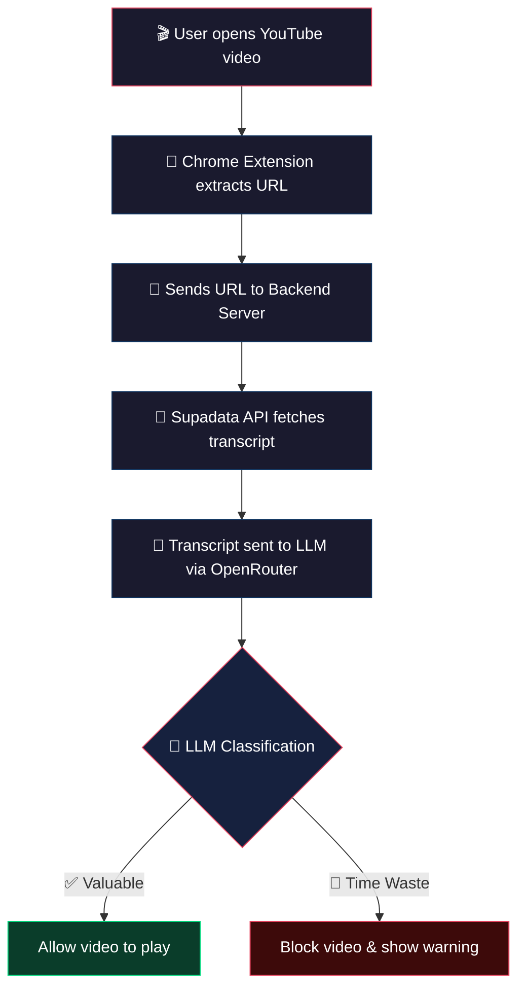

<div align="center">

# 🧠 Anti-Rot

**Stop doomscrolling. Start learning.**

A Chrome extension + Python backend that automatically blocks non-valuable YouTube videos — so you only watch what actually matters.

[](https://chromewebstore.google.com/detail/anti-rot/peicgeopikaehdnnaloamfhhikikegan)
[](#version-log)
[](#)

</div>

---

## ⚡ How It Works

> Browse YouTube like you normally do — Anti-Rot works silently in the background.

| Step | What Happens |
|:----:|:-------------|
| 🎬 | You open a YouTube video |
| 🔗 | The extension detects the video and extracts the URL |
| 📝 | Backend fetches the transcript via **Supadata API** |
| 🤖 | An LLM classifies the video as *educational* or *distraction* |
| ✅ | **Valuable?** Keep watching — nothing changes |
| 🚫 | **Not valuable?** Page gets replaced with a *"Time is valuable"* screen |

---

## 🏗️ Architecture



---

## 📦 Installation

1. Visit the **[Chrome Web Store](https://chromewebstore.google.com/detail/anti-rot/peicgeopikaehdnnaloamfhhikikegan)**
2. Click **"Add to Chrome"**
3. Done — that's it! 🎉

> **Prerequisite:** Any Chromium-based browser (Chrome, Brave, Edge, Arc, etc.)

---

## 📂 Project Structure

```
Anti-Rot/
├── 🧩 Browser Client/        # Chrome extension source
│   ├── manifest.json          # Extension manifest (v3)
│   ├── background.js          # Service worker
│   ├── content.js             # Content script for YT pages
│   ├── content.css            # Injection styles
│   ├── popup.html / .js / .css # Extension popup UI
│   └── icons/                 # Extension icons
├── ⚙️ Server/                  # Python backend
│   ├── server.py              # Flask/FastAPI server
│   ├── Dockerfile             # Container config
│   └── requirements.txt       # Python dependencies
├── 🎨 Promotions/             # Marketing & promo assets
├── 🧪 Testing/                # Test suite
└── 📄 README.md
```

---

## 📋 Version Log

| Version | Milestone |
|:-------:|:----------|
| `v0.1` | 🏗️ Prototype stage |
| `v0.2` | ☁️ Deployed backend on cloud servers |
| `v0.3` | 🔄 Switched from yt-dlp to Supadata for transcripts |
| `v0.4` | 🚀 Completed client-side software — ready for beta shipping |
| `v0.4.1` | 🚀 Making the browser extension public |

---

## 🔮 Upcoming Features

- [ ] **Custom Preferences** — let users define what "valuable" means to them
- [ ] **Multi-language Support** — extend beyond English-language videos
- [ ] **Distraction-free UI** — hide distracting YouTube elements (like Unhook)
- [ ] **Cross-platform** — expand support to sites beyond YouTube

---

## 🧰 Skills & Tech Stack

<div align="center">

| Category | Technologies |
|:---------|:-------------|
| **Frontend** | Chrome Extensions API (Manifest V3), JavaScript, HTML/CSS |
| **Backend** | Python, Flask, Docker |
| **Cloud** | Google Cloud Platform (GCP) |
| **AI/ML** | OpenRouter, LLM APIs |
| **Data** | Supadata Transcript API |

</div>

---

<div align="center">

### 💡 What I Learned Building This

`Creating APIs` · `Deploying Docker on GCP` · `Managing User Accounts` · `Working with LLMs` · `Building Simple & Useful Software`

---

**Version:** v0.4.1 · **Stage:** Prototype

Made with ❤️ by [@prshv1](https://linktr.ee/prshv1)

</div>
